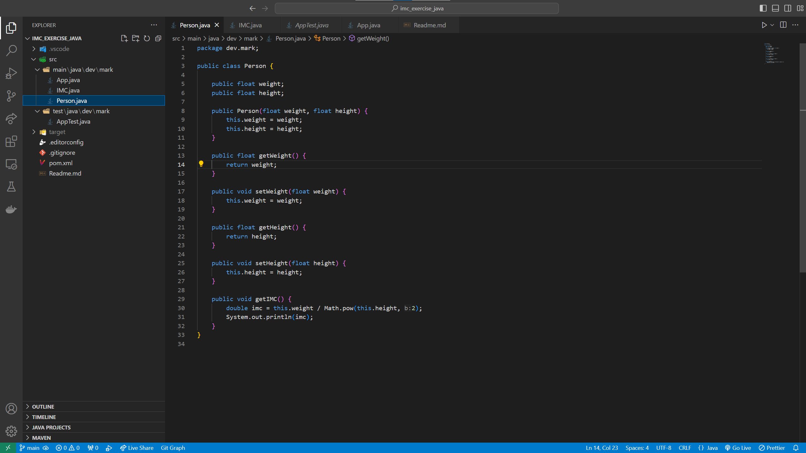
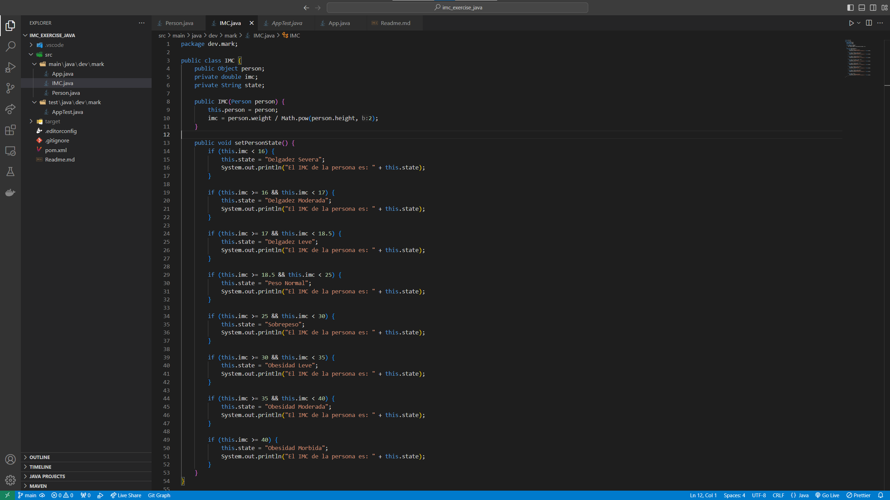
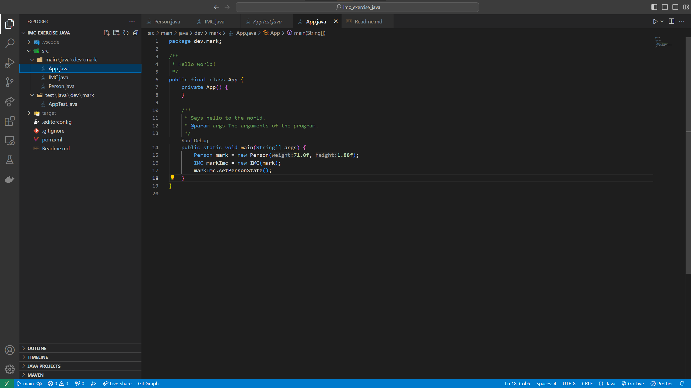

# Body Mass Index Calculator with Java. Factoria F5 exercise.

Hi! In this exercise the goal was to create a program in order to calculate the BMI of a given person. It is made using 2 classes - Person and IMC (Indice de Masa Corporal). The IMC receives a Person instance as an argument in its' constructor and calculates its' BMI using the formula: BMI = weight / height^2. 

## Screenshots

Person Class

IMC Class

App.java

## Thank you for your attention!